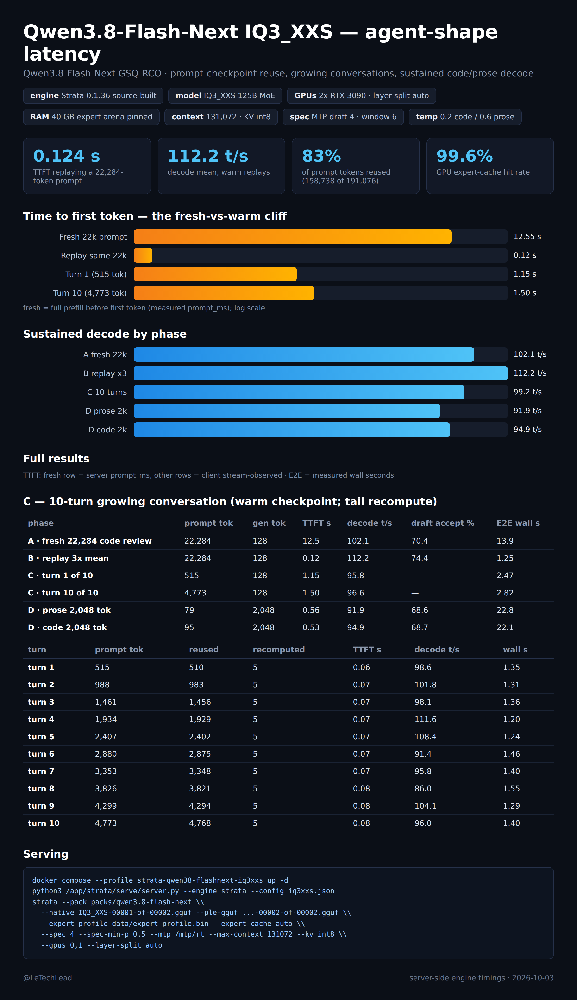

# Strata running Qwen3.8-Flash-Next IQ3_XXS on 2x RTX 3090 — a containerized recipe

Runs [Strata](https://github.com/Niko1221/Strata) (v0.1.36, MIT) on the 125B MoE
`Qwen3.8-Flash-Next-GSQ-RCO-IQ3_XXS` GGUFs from [ISTA-DASLab](https://huggingface.co/ISTA-DASLab/Qwen3.8-Flash-Next-GSQ-RCO-GGUF)
without ever executing Strata's own installer on your host: the engine is compiled inside Docker from
the checksum-pinned upstream tag, the model files are fetched with sha256 verification, and the runtime
container has **no network access at all** — which also means the engine can never self-update under you.

Why bother: Strata's installer (`setup.py`) is honest software — no hidden endpoints, no persistence, no
telemetry (I read it line by line before building this) — but it compiles on your host with `sudo`,
pulls a CUDA toolkit onto your system, re-downloads its binary from GitHub releases at every start,
and keeps its own venv and state outside your service manager. On a box that already serves other models,
that's pollution. This recipe keeps only what the installer actually does that matters — compile the
source, pack the GGUFs, launch the same two processes — and gives it an image and a compose file.

## What you get
- OpenAI-compatible `POST /v1/chat/completions` and Anthropic-compatible `POST /v1/messages`,
  plus `GET /health`, `GET /metrics` (per-request reuse and hit-rate counters).
- The engine's own flags work as upstream documents them: prompt-checkpoint reuse, MTP draft layer
  (speculative decode), two-card layer split with a VRAM expert cache, 131,072-token context.

## Hardware floor (measured, this exact config)
- 2x RTX 3090 (48 GB VRAM): engine loads dense weights + KV + a 21,710-slot expert cache ≈ 35 GiB across the pair; VRAM runs near-full (~460 MiB free — keep your other GPU services off).
- ~62 GB system RAM: the 512-expert MoE arena (~40 GB) is pinned; the 28.8 GB n-gram table streams from SSD. With a serving stack resident, budget nothing else: it fits only when the box is mostly free (Strata's own docs call IQ3_XXS a "64 GB PC" size).
- ~80 GB free disk for shards + pack + MTP (shard 2 is shared across all GSQ-RCO sizes — link it, don't refetch).
- NVIDIA driver ≥ 580 (CUDA 13 runtime).

## Steps
```bash
# 0. build the engine image (fetches llama.cpp 3cf03257, verifies sha256)
./scripts/fetch-strata.sh                       # repo @ tag v0.1.36 -> ./strata-src/
docker build -t strata:0.1.36 .                 # ~15 min on a 12-core box

# 1. model weights (resumable, sha256-verified against HuggingFace LFS oids)
./scripts/fetch-model.sh ./models

# 2. pack + MTP draft layer — runs entirely inside the image
./scripts/prepare-data.sh ./models ./data

# 3. serve
cp config/iq3xxs.json.example config/iq3xxs.json   # set api_key, port as you like
docker compose up -d                               # healthcheck on /health
```

Clients (any OpenAI SDK): base URL `http://<host>:8080/v1`, model name `qwen3.8-flash-next-iq3xxs`.
Anthropic-style clients: `http://<host>:8080/v1/messages`.

## Benchmark 1: context ladder (`benchmark/context-ladder.png`)

llama-benchy 0.4.0 · pp 4,096 / tg 512 (exact-tg) · 3 runs per depth · unique requests (`--no-cache`) ·
depths 8,192 / 32,768 / 65,536 / 126,208 (near-max: 131,072 − 4,096 − 512 − margin) ·
tokenizer `Qwen/Qwen3.8-Flash-Next` · prefill rate = (depth + 4,096) ÷ full-prefill wall time ·
engine restarted into a clean session before the published run.

| depth | prefill t/s | decode t/s | peak decode | TTFT | E2E (est.) |
|---|---|---|---|---|---|
| 8,192 | 1,145 ± 7 | 107.3 ± 6.7 | 108.0 | 10.73 s | 15.50 s |
| 32,768 | 1,852 ± 2 | 105.4 ± 2.2 | 105.7 | 19.91 s | 24.76 s |
| 65,536 | 2,192 ± 1 | 98.3 ± 9.1 | 99.0 | 31.77 s | 36.98 s |
| 126,208 | 2,317 ± 1 | 93.9 ± 6.7 | 94.3 | 56.23 s | 61.68 s |

Raw benchy tables for all three engine versions measured on this box:
`context-ladder-0.1.36.md` (above), `context-ladder-0.1.30.md`, `context-ladder-0.1.27.md` —
same pack; the 0.1.27/0.1.30 tables were taken with llama-benchy 0.3.5, whose "peak decode" column
measured warmup bursts, so the 0.1.36 peak column (≈ the tg mean) is not comparable to those two —
use decode t/s for cross-version comparison. Against 0.1.30 (same protocol): prefill +5.6% at 8k to
+16% at 126k (TTFT at 126k: 65.3 s → 56.2 s; the flat per-token prefill cost fell ~0.46 → ~0.39 ms),
ladder decode +8–10%. 0.1.27 was flat ~660–678 t/s at every depth; 0.1.30's 1024-token
expert-streaming prefill made deep prefill 2.4–3x faster. If you are upgrading from a 0.1.27 or
0.1.30 pack: the pack format (`native experts v3`), the serve config keys, and the engine flags below
are unchanged — rebuild the image, reuse `data/`.

## Benchmark 2: agent-shape results (`benchmark/`)



`agent-shape-card.html` is the editable source of the PNG above; `agent-bench-results.json` is the raw
per-request artifact behind it. Measured on v0.1.36 with server-side engine timings (not client
estimates), engine restarted into a clean session, D re-run at the published temperatures
(0.6 prose / 0.2 code), the numbers that matter for coding agents:

| scenario | result |
|---|---|
| cold 22,284-token prompt prefill | 12.55 s (~1,776 t/s) |
| same prompt replayed (checkpoint warm) | **0.12 s TTFT** — only 5 new tokens recompute |
| warm decode | 99–112 t/s (B replay mean 112.2) |
| sustained 2,048-token decode | prose 91.9 t/s / code 94.9 t/s |
| MTP accept | prose 68.6% / code 68.7% on sustained runs; ~70–80% on short replays |
| 10-turn growing conversation | every warm turn reused all-but-5 tokens; TTFT 0.064→0.077 s |
| session-wide | 83% of prompt tokens reused; expert-cache hit 99.6% |

Two honest notes against the v0.1.30 run: the prompt corpus here is a different ~22k-token code
prompt (0.1.30's was 25,078 tokens), so compare the **marginal** prefill cost — 0.657 → 0.563
ms/token, ~14% cheaper — not the absolute seconds. And sustained long generation regressed:
0.1.30 measured 110.7 t/s at 80.8% draft accept on the same 2,048-token prose run; 0.1.36 gives
91.9 t/s at 68.6%. Short agent turns are faster everywhere on the ladder and replay path;
marathon decoding accepts fewer drafts — reproduced in a separate temp-matched pass, so not a
sampling artifact. We measured it, we don't have a cause; upstream changed the verify/sampler path
between 0.1.31 and 0.1.36.

The cliff is still real and now shallower still: first turn on a new 22k context costs ~13 s
(0.1.30: ~16.5 s for 25k; 0.1.27: ~40 s); every turn that keeps its prefix costs ~0.12 s. Agents
that reuse sessions feel this engine; agents that re-dump context pay for it every time.

## Honest caveats (from reading the source, not the marketing)
- **Self-update by design:** with network access, `setup.py` re-downloads the release binary at every
  start if its version gate wants newer. The runtime container here has no egress, so the binary can
  never change after build. Keep it that way unless you trust the upstream release stream.
- **No checksums on model downloads** in their installer; `fetch-model.sh` adds verification against HF's
  published LFS sha256s.
- **Single sequence at a time** (FIFO). Parallel sub-agents queue, including against chat use.
- **Pinned arena = one big load-time stall:** first load locks ~40 GB into RAM (~22 s at 4.2 GiB/s
  on the 0.1.36 launch; theirs, not ours — the runs survived it fine).
- IQ3_XXS at 262k context is **not** supported by this config (their own installer caps < 90 GB boxes at 128k;
  deep-context prefill gets slower still and the KV is int8 here).
- The engine moves fast (v0.1.30 -> v0.1.36 in three days) and is essentially one maintainer plus PRs.
  The MIT license and the audited code are what make a pinned fork-in-a-container sane; none of it makes
  it a drop-in for vLLM.

## Layout
```
Dockerfile                     two-stage build (devel->compile -> runtime)
scripts/fetch-strata.sh        pinned repo tarball (tag v0.1.36) + sha256
scripts/fetch-model.sh         IQ3_XXS shards + sha256 (shard 2 dedupe documented inline)
scripts/prepare-data.sh        pack + tokenizer + MTP range-fetch/pack/rt (inside the image)
config/iq3xxs.json.example     server.py config (exe/args/gpu list = layer split)
docker-compose.yml             service definition, no egress at runtime
benchmark/                     both cards (PNG + HTML source) + raw artifacts
NOTICE / LICENSE               provenance
```
`strata-src/`, `models/`, `data/`, `config/iq3xxs.json` are gitignored — everything is reproducible via the scripts.

## Provenance / licenses
- Strata engine + server: © Niko1221 and contributors, MIT — https://github.com/Niko1221/Strata @ `v0.1.36` (commit `36fa455e`).
- llama.cpp (ggml/gguf-py/mtmd) pinned at `3cf03257f219`, MIT (unchanged by Strata v0.1.28–v0.1.36; re-verified in v0.1.36's setup.py 2026-10-03).
- Model weights: Qwen team + GSQ-RCO quants by ISTA-DASLab — see the HF repo's terms; you fetch them yourself.
- Scripts/Dockerfile/README in this repo: MIT.

Recipe and benchmark: @LeTechLead
