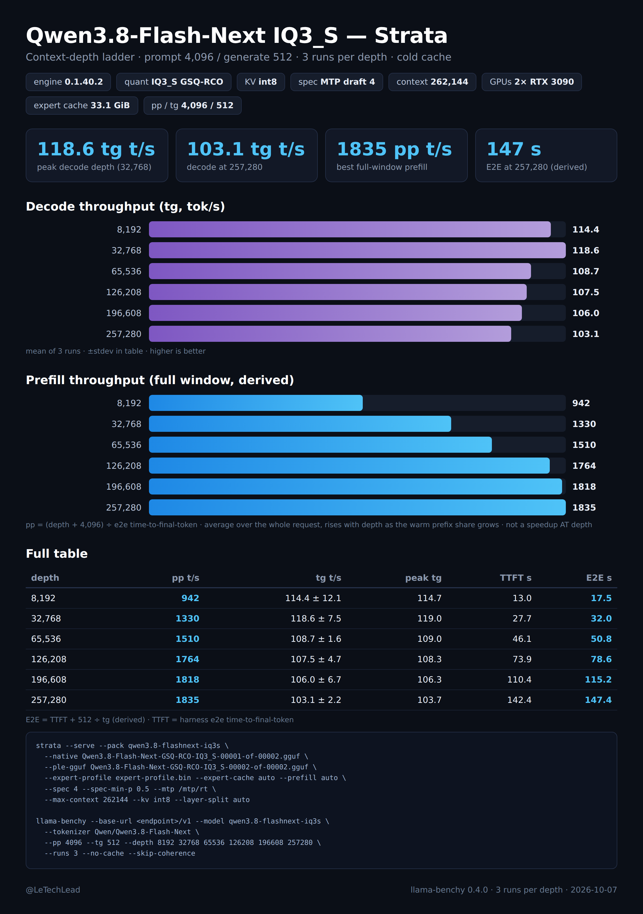

# Strata running Qwen3.8-Flash-Next IQ3_S on 2x RTX 3090 — a containerized recipe

Runs [Strata](https://github.com/Niko1221/Strata) (v0.1.40.2, MIT) on the 125B MoE
`Qwen3.8-Flash-Next-GSQ-RCO-IQ3_S` GGUFs from [ISTA-DASLab](https://huggingface.co/ISTA-DASLab/Qwen3.8-Flash-Next-GSQ-RCO-GGUF)
without ever executing Strata's own installer on your host: the engine is compiled inside Docker from
the checksum-pinned upstream tag, the model files are fetched with sha256 verification, and the runtime
container has **no network access at all** — which also means the engine can never self-update under you.

Why bother: Strata's installer (`setup.py`) is honest software — no hidden endpoints, no persistence, no
telemetry (I read it line by line before building this) — but it compiles on your host with `sudo`,
pulls a CUDA toolkit onto your system, re-downloads its binary from GitHub releases at every start,
and keeps its own venv and state outside your service manager. On a box that already serves other models,
that's pollution. This recipe keeps only what the installer actually does that matters — compile the
source, pack the GGUF, launch the same two processes — and gives it an image and a compose file.

## What you get
- OpenAI-compatible `POST /v1/chat/completions` and Anthropic-compatible `POST /v1/messages`,
  plus `GET /health`, `GET /metrics` (per-request reuse and hit-rate counters; Prometheus text
  format via `Accept` since 0.1.40.2).
- The engine's own flags work as upstream documents them: prompt-checkpoint reuse, MTP draft layer
  (speculative decode), two-card layer split with a VRAM expert cache, **262,144-token context** —
  the IQ3_S shards' native trained window (`qwen4exp.context_length` in the GGUF metadata).

## Hardware floor (measured, this exact config)
- 2x RTX 3090 (48 GB VRAM): engine loads dense weights + KV + a 17,076-slot expert cache (33,084 MiB
  across the pair); VRAM runs near-full (~457 MiB free — keep your other GPU services off).
- ~62 GB system RAM: the 512-expert MoE arena (~48 GB, measured 47,962 MiB at load) is pinned; the rest
  streams from SSD. With a serving stack resident, budget nothing else: it fits only when the box is
  mostly free.
- ~85 GB free disk for shards + pack + MTP (shard 2 is byte-identical across all GSQ-RCO sizes — link
  it, don't refetch).
- NVIDIA driver ≥ 580 (CUDA 13 runtime).
- **Context ceiling:** 262,144 is hard. We probed above native: YaRN extrapolation steals VRAM from the
  GPU expert cache — slots collapse (~17k → 3,812 at 2M), decode craters (~80 → 40 t/s), and past ~3M
  the session allocation fails outright. Don't raise `--max-context`; the native window is the recipe.

## Steps
```bash
# 0. build the engine image (fetches llama.cpp 3cf03257, verifies sha256)
./scripts/fetch-strata.sh                       # repo @ tag v0.1.40.2 -> ./strata-src/
docker build -t strata:0.1.40.2 .               # ~15 min on a 12-core box

# 1. model weights (resumable, sha256-verified against HuggingFace LFS oids)
./scripts/fetch-model.sh ./models

# 2. pack + MTP draft layer — runs entirely inside the image
./scripts/prepare-data.sh ./models ./data

# 3. serve
cp config/iq3s.json.example config/iq3s.json    # set api_key, port as you like
docker compose up -d                            # healthcheck on /health
```

Clients (any OpenAI SDK): base URL `http://<host>:8080/v1`, model name `qwen3.8-flashnext-iq3s`.
Anthropic-style clients: `http://<host>:8080/v1/messages`.

## Benchmark 1: context ladder (`benchmark/context-ladder.png`)



llama-benchy 0.4.0 · pp 4,096 / tg 512 · 3 runs per depth · unique requests (`--no-cache`) ·
depths 8,192 → 257,280 (the top rung is 98% of the 262,144 window — the rungs above 126k only exist
because IQ3_S serves native 262k) · tokenizer `Qwen/Qwen3.8-Flash-Next` ·
prefill rate = (depth + 4,096) ÷ full-prefill wall time · engine restarted into a clean session.

| depth | prefill t/s | decode t/s | peak decode | TTFT | E2E (est.) | E2E Δ vs 0.1.40.1 |
|---|---|---|---|---|---|---|
| 8,192 | 942 | 114.4 ± 12.1 | 114.7 | 13.0 s | 17.5 s | −6.1% |
| 32,768 | 1,330 | 118.6 ± 7.5 | 119.0 | 27.7 s | 32.0 s | −2.2% |
| 65,536 | 1,510 | 108.7 ± 1.6 | 109.0 | 46.1 s | 50.8 s | −0.5% |
| 126,208 | 1,764 | 107.5 ± 4.7 | 108.3 | 73.9 s | 78.6 s | −11.7% |
| 196,608 | 1,818 | 106.0 ± 6.7 | 106.3 | 110.4 s | 115.2 s | −7.9% |
| 257,280 | 1,835 | 103.1 ± 2.2 | 103.7 | 142.4 s | 147.4 s | −8.8% |

Raw benchy tables: `context-ladder-0.1.40.2.md`; the 0.1.40.1 run is kept
(`context-ladder-0.1.40.1.md`) — the Δ column is computed from both raw tables: same box, same model
config, same protocol, one variable (the engine image). The first rungs' prefill is cold-window (CUDA
graph capture); steady prefill is ~1,330–1,835 t/s. What 0.1.40.2 changed here: the gain concentrates
at the deep rungs — TTFT −8 to −12% from 126k up (84.0 ± 1.2 s → 73.9 ± 0.1 s at 126k: the error bars
cannot overlap), while 65k and the shallow half moved ≤2% (noise). That matches the upstream claim
("up to +60% prompt speed on multi-GPU layer split": an auto-placement tie could pick the unbalanced
split; now the balanced placement wins) in direction but not in magnitude — measured here is +8–14%
derived prefill at depth, not +60%, and short-prompt prefill, sustained decode, and replay paths are
flat to within spec-decode run variance. The 40%-flavoured headline does not reproduce on this
P2P-less 2×3090 pair. Decode still holds 103–108 t/s from 126k to 257k.

Against the IQ3_XXS predecessor (0.1.39, same protocol, 131k window): IQ3_S decode matches XXS within
−2 to +4% at every shared depth, but IQ3_S pays the prefill tax on this P2P-less pair (~3.3 GB/s PCIe expert
stream): ~942–1,835 pp t/s vs XXS's 1,193–2,376, so E2E is +19–44% at matched depths. What the
trade buys: twice the window (XXS caps at 131k on this box), unchanged deep decode, and a smarter
3-bit point. Warm-agent metrics actually *improve* over XXS (replay TTFT 0.166 → 0.119 s, sustained prose
97.1 → 102.2 t/s) — see `benchmark/` for both sides' raw artifacts.

If you are upgrading from an older pinned build of this recipe (v0.1.30/v0.1.36/v0.1.39/v0.1.40.1): the pack
format (`native experts v3`), the serve config keys, and the engine flags are unchanged — rebuild the
image, reuse `data/`. Only `--max-context` moves if you bump the quant. For 0.1.40.2 specifically the
serve config does not change either; one build-side note — upstream flipped the vision encoder's
`STRATA_PORTABLE` default to ON in 0.1.40.2, so the Dockerfile now passes `-DSTRATA_PORTABLE=OFF`
explicitly (as upstream's own build does) to keep the native CPU tuning.

## Benchmark 2: agent-shape results (`benchmark/`)


`agent-shape-card.html` is the editable source of the PNG above; `agent-bench-results.json` is the raw
per-request artifact behind it. Measured on v0.1.40.2 with server-side engine timings (not client
estimates), engine restarted into a clean session, D at the published temperatures (0.6 prose /
0.2 code), the numbers that matter for coding agents:

| scenario | result |
|---|---|
| cold 22,284-token prompt prefill | 19.1 s (1,271 t/s) |
| same prompt replayed (checkpoint warm) | **0.121 s TTFT** — only 5 new tokens recompute (44.8 ms prompt) |
| warm decode | 116–121 t/s (B replay mean ~118) |
| sustained 2,048-token decode | prose 102.2 t/s / code 106.6 t/s (temp-matched) |
| MTP accept | prose 65% / code 68% on sustained runs; session-wide 67.6% |
| 10-turn growing conversation | cold turns TTFT 2.0→2.8 s; replay pass 0.063→0.077 s/turn, decode ~111.9 t/s |
| session-wide | 80.2% of prompt tokens reused (110,734 of 138,030); 0 aborts |

The cliff is the same physics as every quant: first turn on a new 22k context costs ~19 s; every turn
that keeps its prefix costs ~0.12 s. Agents that reuse sessions feel this engine; agents that re-dump
context pay the IQ3_S byte tax on every one.

Also measured, not carded: a custom agentic coding suite (8 shell-tool tasks × 3 passes, native
function calling, temp 0) at **19/24 = 79.2%** on 0.1.40.2 (6/8, 6/8, 7/8). The same tasks on 0.1.40.1
scored 22/24 the same morning with the identical harness; every failure here is a test exit-1 (no
harness errors). Two tasks split the runs: `file-pipeline` failed 3/3 on 0.1.40.2 (it had already
failed 2/3 on 0.1.40.1) and `memoize-kwargs` — which passed 3/3 on 0.1.40.1 — failed 2/3. At temp 0
with speculative decode the run-to-run spread on these edge tasks is real, so I do not call it a
regression; I do report the slide honestly rather than quietly carrying the old number. Terminal-Bench 2.1 subset (8
expert-level tasks via the official Harbor harness) again **0/8** (all trials scored, reward 0.0, zero
harness/infra errors) — the agent loop runs to the full turn budget without producing the required
artifacts; it reads as task difficulty, not plumbing. Raw: `benchmark/cd-matched-results.json`.

## Layout
```
Dockerfile                     two-stage build (devel->compile -> runtime)
scripts/fetch-strata.sh        pinned repo tarball (tag v0.1.40.2) + sha256
scripts/fetch-model.sh         IQ3_S shards + sha256 (shard 2 dedupe documented inline)
scripts/prepare-data.sh        pack + tokenizer + MTP range-fetch/pack/rt (inside the image)
config/iq3s.json.example       server.py config (exe/args/gpu list = layer split)
docker-compose.yml             service definition, no egress at runtime
benchmark/                     both cards (PNG + HTML source) + raw artifacts
NOTICE / LICENSE               provenance
```
`strata-src/`, `models/`, `data/`, `config/iq3s.json` are gitignored — everything is reproducible via the scripts.

## Provenance / licenses
- Strata engine + server: © Niko1221 and the Strata contributors, MIT — https://github.com/Niko1221/Strata @ `v0.1.40.2` (commit `e8ca9afd`, tarball sha256 `80f32a37852401a5…`).
- llama.cpp (ggml/gguf-py/mtmd) pinned at `3cf03257f219`, MIT (unchanged by Strata through v0.1.40.2; re-verified in v0.1.40.2's CMakeLists + setup.py 2026-10-07).
- Model weights: Qwen team + GSQ-RCO quants by ISTA-DASLab — see the HF repo's terms; you fetch them yourself. IQ3_S shard1 `4c1eb2ceb4915e11…` (54,817,524,224 B), shard2 `316b46f3a2dbd68c…` (28,800,138,432 B) — both match the HF LFS oids (re-checksummed against the live files 2026-10-07).
- Scripts/Dockerfile/README in this repo: MIT.

Recipe and benchmark: @LeTechLead
